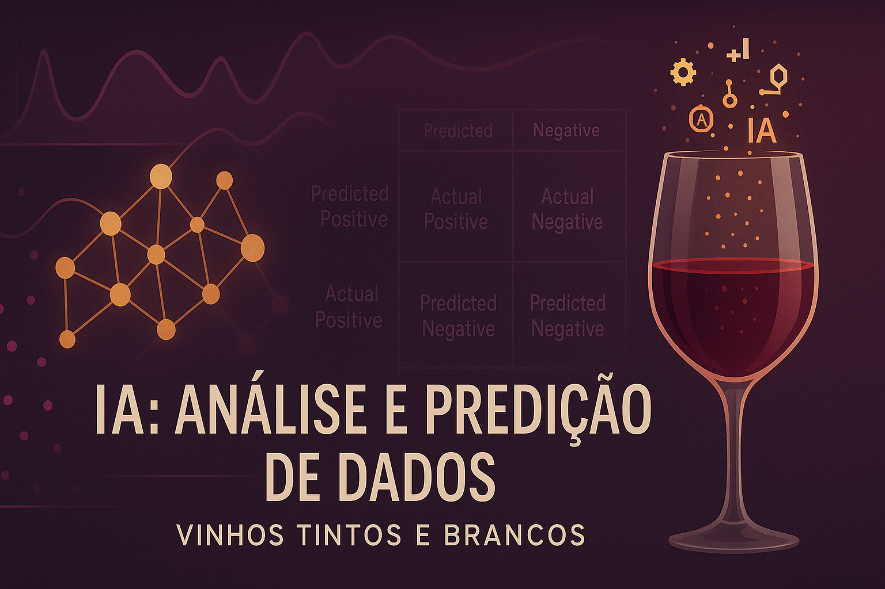
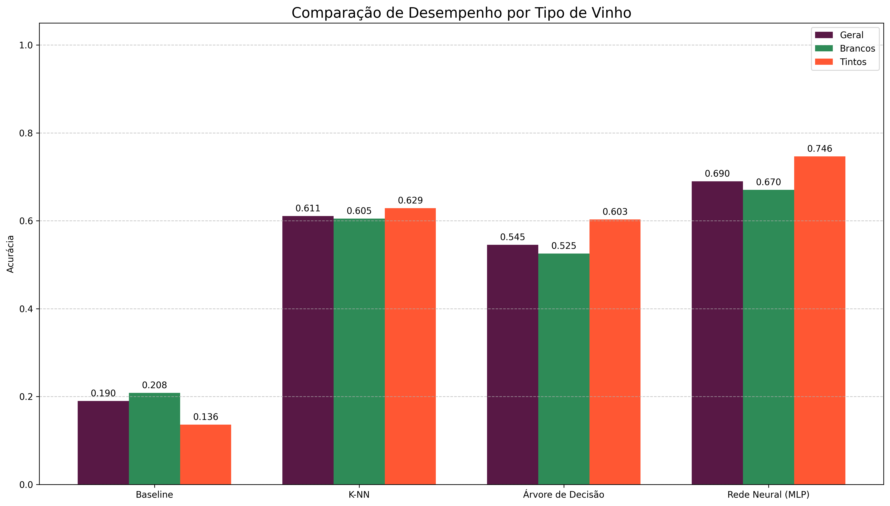

# WineIA



## 🍷 Sistema de Análise Preditiva da Qualidade de Vinhos

### 📖 Descrição do Projeto

Este projeto foi desenvolvido para a disciplina de Inteligência Artificial e consiste em um sistema completo para análise, pré-processamento e predição da qualidade de vinhos. Utilizando a base de dados "Wine Quality" do repositório UCI, o sistema implementa um pipeline de Machine Learning para classificar vinhos em três categorias de qualidade (Ruim, Normal e Bom) e compara o desempenho de diferentes algoritmos.

O projeto oferece três modos de interação: uma Interface Gráfica (GUI) completa, uma Interface de Linha de Comando (CLI) com gráficos e uma versão CLI puramente textual, garantindo flexibilidade e acessibilidade.

### ✨ Funcionalidades Principais

- **🚀 Três Modos de Execução:** Interface Gráfica (GUI com PyQt5), CLI com gráficos (Matplotlib/Seaborn) e CLI puramente textual.
- **📊 Análise Exploratória Completa:** Estatísticas descritivas, matriz de correlação, histogramas de distribuição e boxplots para identificação de outliers.
- **⚙️ Pipeline de Pré-processamento Robusto:**
    - Limpeza de dados (remoção de duplicatas)
    - Tratamento de desbalanceamento de classes com SMOTE
    - Padronização de atributos com StandardScaler
    - Redução de dimensionalidade opcional com PCA
- **🧠 Comparação de Modelos de Machine Learning:**
    - DummyClassifier (Baseline)
    - K-Nearest Neighbors (K-NN)
    - Decision Tree (Árvore de Decisão)
    - Multi-layer Perceptron (Rede Neural)
- **📈 Avaliação Detalhada:** Métricas completas (Acurácia, Precisão, Recall, F1-Score, Especificidade), matrizes de confusão e análise de estabilidade com Validação Cruzada.
- **🥂 Análise Segmentada:** Avaliação de performance separada para vinhos tintos e brancos.

### 📦 Base de Dados

O projeto utiliza a base de dados Wine Quality, que combina dados de vinhos tintos e brancos portugueses. Os dados foram obtidos do [UCI Machine Learning Repository - Wine Quality](https://archive.ics.uci.edu/dataset/186/wine+quality).

- **Atributos:** 11 variáveis físico-químicas (como acidez, açúcar, álcool, etc.) e uma nota de qualidade sensorial (de 3 a 9).

### 🛠️ Tecnologias Utilizadas

- **Linguagem:** Python 3
- **Análise de Dados:** Pandas, NumPy
- **Machine Learning:** Scikit-learn, Imbalanced-learn
- **Visualização de Dados:** Matplotlib, Seaborn
- **Interface Gráfica:** PyQt5

### ⚙️ Configuração do Ambiente

Para executar este projeto, recomenda-se criar um ambiente virtual e instalar as dependências.

1. Clone o repositório:
        ```bash
        git clone https://github.com/alessandro0augusto0/wine-quality-prediction-project.git
        cd nome-do-repositorio
        ```

2. Crie e ative um ambiente virtual (opcional, mas recomendado):

        **Windows**
        ```bash
        python -m venv venv
        .\venv\Scripts\activate
        ```

        **macOS/Linux**
        ```bash
        python3 -m venv venv
        source venv/bin/activate
        ```

3. Instale as dependências:
        ```bash
        pip install -r requirements.txt
        ```

        **Exemplo de `requirements.txt`:**
        ```
        pandas
        numpy
        scikit-learn
        imbalanced-learn
        matplotlib
        seaborn
        PyQt5
        ```

### 🚀 Como Executar

Execute o script principal para iniciar o sistema e escolher o modo de operação:

```bash
python main.py
```

Você será apresentado com as seguintes opções:

- Digite **1** para iniciar a Interface Gráfica (GUI).
- Digite **2** para iniciar a Interface de Terminal (CLI com Gráficos).
- Digite **3** para iniciar a Interface de Terminal (CLI Manual - Texto), que não requer bibliotecas gráficas para exibir os resultados.
- Digite **4** para iniciar a Interface Gráfica (CLI Manual - Texto), que não requer bibliotecas gráficas para exibir os resultados.

### 📂 Estrutura do Projeto

```
.
├── docs/
│   ├── winequality-red.csv
│   └── winequality-white.csv
├── gui/
│   ├── app.py          # Lógica e layout da interface gráfica (PyQt5)
│   ├── engine.py       # Motor de Machine Learning para a GUI
│   └── threads.py      # Gerenciamento de threads para a GUI
├── cli.py              # Versão do programa para terminal com gráficos
├── cli_manual.py       # Versão do programa para terminal em modo texto
├── main.py             # Script principal para iniciar os modos de execução
└── README.md           # Este arquivo
```

### 📊 Resultados e Análise

Após o treinamento e avaliação, a Rede Neural (MLP) se destacou como o modelo de melhor desempenho, superando os demais algoritmos em acurácia e F1-Score, tanto no pipeline padrão quanto no pipeline com PCA.

#### Comparativo de Acurácia (Pipeline Padrão)

| Modelo             | Acurácia Geral | Acurácia (Brancos) | Acurácia (Tintos) |
|--------------------|:--------------:|:------------------:|:-----------------:|
| Baseline           |     0.1898     |      0.2083        |      0.1360       |
| K-NN               |     0.6109     |      0.6048        |      0.6287       |
| Árvore de Decisão  |     0.5451     |      0.5253        |      0.6029       |
| Rede Neural (MLP)  |     0.6898     |      0.6705        |      0.7463       |

> Observação: Todos os modelos apresentaram uma performance notavelmente superior na classificação de vinhos tintos, sugerindo que os atributos físico-químicos são melhores preditores de qualidade para este tipo de vinho.

**Gráfico de Comparação Detalhada:**  
**Gráfico de Comparação Detalhada:**  


### 📄 Licença

Este projeto está sob a licença MIT. Veja o arquivo LICENSE para mais detalhes.

---

Trabalho Prático 3 - Inteligência Artificial  
Aluno: Alessandro Augusto F. D. Oliveira  
Professor: Douglas Castilho
